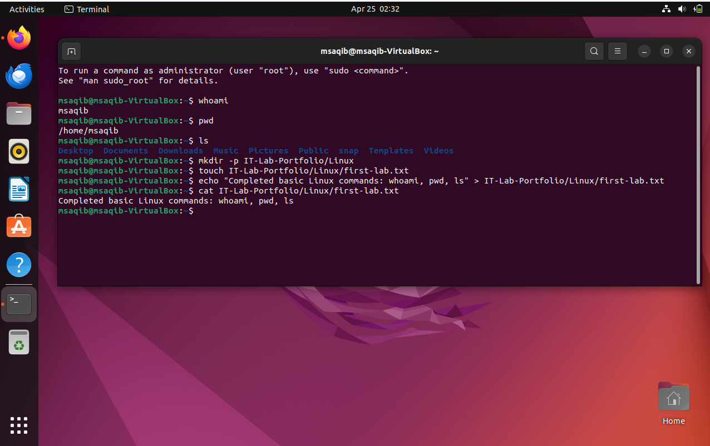
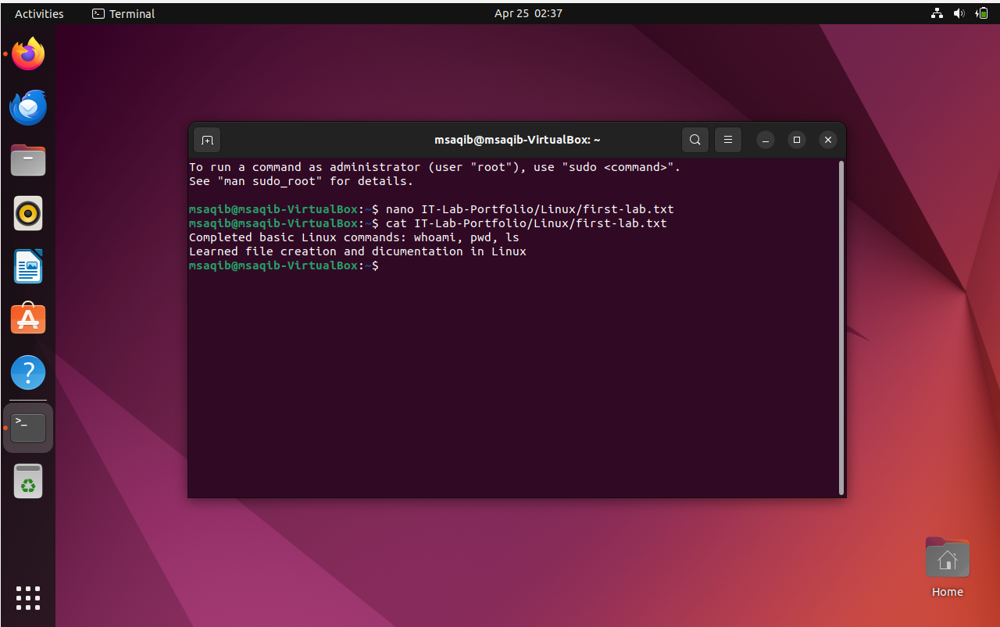
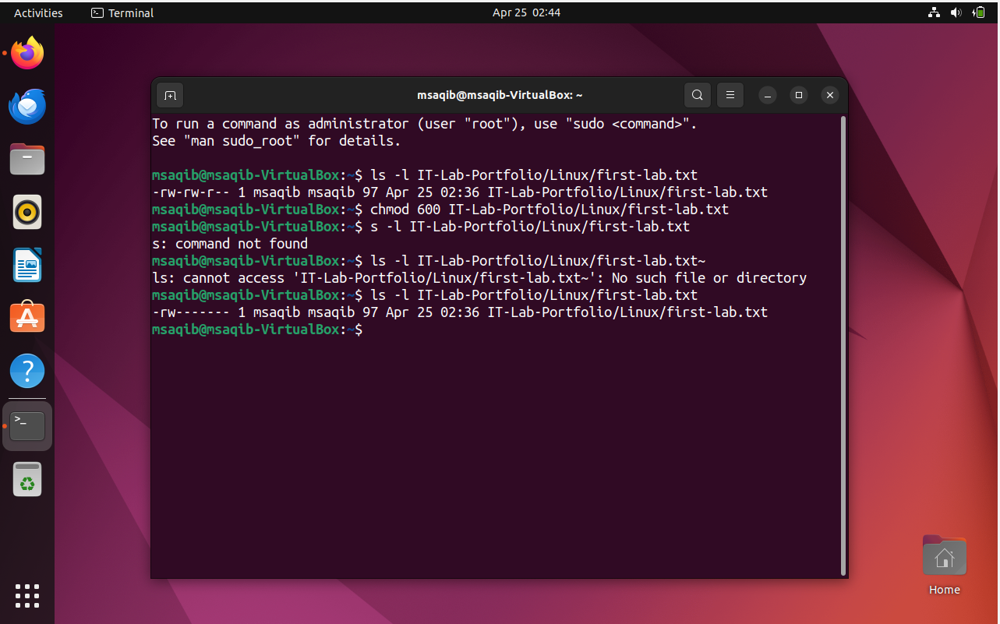
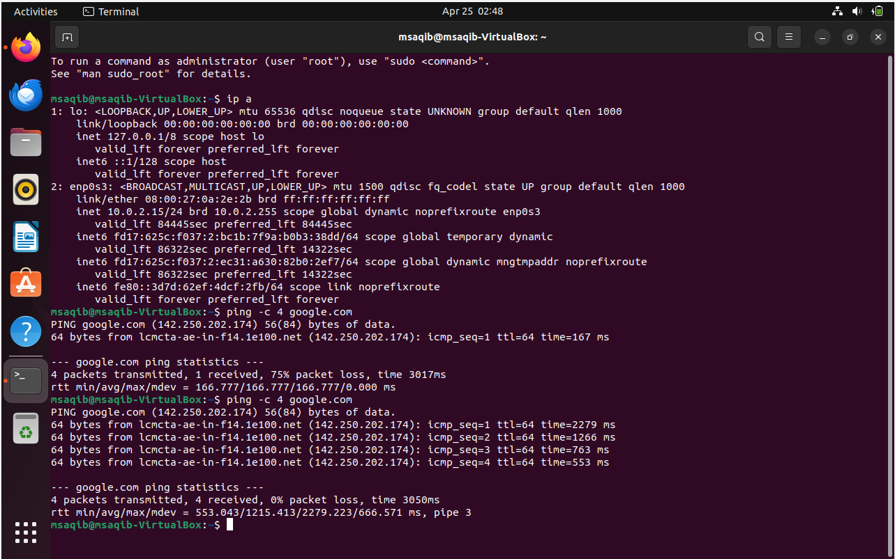
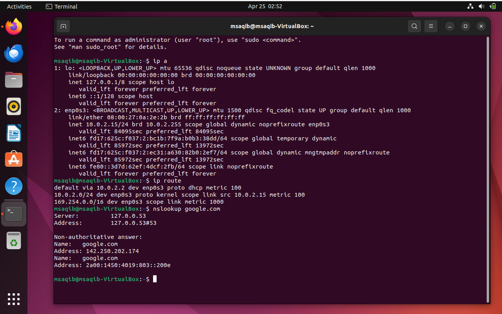

[10:30 AM, 4/26/2026] محمد اعکراش: # 🐧 Ubuntu Linux — Command Line & Networking Lab

## 📋 Project Overview
Hands-on Ubuntu Linux lab built in VirtualBox covering 
essential command line skills, file management, 
permissions and network configuration.

## 🛠️ Tools & Technologies
| Tool | Details |
|------|---------|
| OS | Ubuntu Linux |
| Virtualization | Oracle VirtualBox |
| Interface | Terminal (CLI) |
| User | msaqib |

## ✅ What I Practiced
| Task | Status |
|------|--------|
| Basic Linux Commands | ✅ Done |
| File Creation & Management | ✅ Done |
| Text Editor (nano) | ✅ Done |
| File Permissions (chmod) | ✅ Done |
| Network Configuration (ip a) | ✅ Done |
| Ping & Connectivity Testing | ✅ Done |
| Routing Table (ip route) | ✅ Done |
| DNS Lookup (nslookup) | ✅ Done |

---

## 📸 Screenshots

### 🖥️ Basic Linux Commands

*1️⃣ Basic Commands — whoami, pwd, ls, mkdir*

> Practiced essential Linux commands:
> - whoami — identified current user as msaqib
> - pwd — showed current directory /home/msaqib
> - ls — listed Desktop, Documents, Downloads folders
> - mkdir — created IT-Lab-Portfolio/Linux directory
> - touch — created first-lab.txt file
> - echo — wrote text content into file
> - cat — displayed file contents to verify

---

*2️⃣ File Editing with Nano Text Editor*

> - nano — opened and edited first-lab.txt file
> - cat — verified file contents showing two lines:
>   "Completed basic Linux commands: whoami, pwd, ls"
>   "Learned file creation and documentation in Linux"
> Demonstrates ability to create and edit files 
> using Linux terminal text editor

---

*3️⃣ File Permissions with chmod*

> - ls -l — showed original permissions -rw-rw-r--
>   meaning owner/group read-write, others read-only
> - chmod 600 — changed to private owner-only access
> - ls -l — verified new permissions -rw-------
>   meaning only owner can read and write the file
> Demonstrates understanding of Linux permission system

---

### 🌐 Network Configuration

*4️⃣ Network Interface & Ping Test*

> - ip a — displayed network interfaces showing
>   IP address 10.0.2.15 on enp0s3 adapter
> - ping -c 4 google.com — first test showed 75% 
>   packet loss (network issue detected)
> - ping -c 4 google.com — second test showed 0%
>   packet loss confirming stable connectivity
> Demonstrates network troubleshooting skills

---

*5️⃣ Routing Table & DNS Lookup*

> - ip a — confirmed IP 10.0.2.15 on enp0s3
> - ip route — displayed routing table showing:
>   default gateway 10.0.2.2 via enp0s3
> - nslookup google.com — successfully resolved
>   google.com to 142.250.202.174
> Demonstrates DNS resolution and routing knowledge

---

## 🎯 Skills Demonstrated
- Linux Terminal & Command Line Interface (CLI)
- File System Navigation & Management
- File Creation & Text Editing (nano)
- Linux File Permissions (chmod)
- Network Interface Configuration (ip a)
- Internet Connectivity Testing (ping)
- Routing Table Analysis (ip route)
- DNS Resolution & Troubleshooting (nslookup)
- VirtualBox Linux VM Setup & Management
[10:33 AM, 4/26/2026] محمد اعکراش: https://github.com/greenlander59/Ubuntu-Linux-Lab
[10:34 AM, 4/26/2026] محمد اعکراش: # 🐧 Ubuntu Linux — Command Line & Networking Lab

## 📋 Project Overview
Hands-on Ubuntu Linux lab built in VirtualBox covering 
essential command line skills, file management, 
permissions and network configuration.

## 🛠️ Tools & Technologies
| Tool | Details |
|------|---------|
| OS | Ubuntu Linux |
| Virtualization | Oracle VirtualBox |
| Interface | Terminal (CLI) |
| User | msaqib |

## ✅ What I Practiced
| Task | Status |
|------|--------|
| Basic Linux Commands | ✅ Done |
| File Creation & Management | ✅ Done |
| Text Editor (nano) | ✅ Done |
| File Permissions (chmod) | ✅ Done |
| Network Configuration (ip a) | ✅ Done |
| Ping & Connectivity Testing | ✅ Done |
| Routing Table (ip route) | ✅ Done |
| DNS Lookup (nslookup) | ✅ Done |

---

## 📸 Screenshots

### 🖥️ Basic Linux Commands

*1️⃣ Basic Commands — whoami, pwd, ls, mkdir*

> Practiced essential Linux commands:
> - whoami — identified current user as msaqib
> - pwd — showed current directory /home/msaqib
> - ls — listed Desktop, Documents, Downloads folders
> - mkdir — created IT-Lab-Portfolio/Linux directory
> - touch — created first-lab.txt file
> - echo — wrote text content into file
> - cat — displayed file contents to verify

---

*2️⃣ File Editing with Nano Text Editor*

> - nano — opened and edited first-lab.txt file
> - cat — verified file contents showing two lines:
>   "Completed basic Linux commands: whoami, pwd, ls"
>   "Learned file creation and documentation in Linux"
> Demonstrates ability to create and edit files
> using Linux terminal text editor

---

*3️⃣ File Permissions with chmod*

> - ls -l — showed original permissions -rw-rw-r--
>   meaning owner/group read-write, others read-only
> - chmod 600 — changed to private owner-only access
> - ls -l — verified new permissions -rw-------
>   meaning only owner can read and write the file
> Demonstrates understanding of Linux permission system

---

### 🌐 Network Configuration

*4️⃣ Network Interface & Ping Test*

> - ip a — displayed network interfaces showing
>   IP address 10.0.2.15 on enp0s3 adapter
> - ping -c 4 google.com — first test showed 75%
>   packet loss (network issue detected)
> - ping -c 4 google.com — second test showed 0%
>   packet loss confirming stable connectivity
> Demonstrates network troubleshooting skills

---

*5️⃣ Routing Table & DNS Lookup*

> - ip a — confirmed IP 10.0.2.15 on enp0s3
> - ip route — displayed routing table showing
>   default gateway 10.0.2.2 via enp0s3
> - nslookup google.com — successfully resolved
>   google.com to 142.250.202.174
> Demonstrates DNS resolution and routing knowledge

---

## 🎯 Skills Demonstrated
- Linux Terminal & Command Line Interface (CLI)
- File System Navigation & Management
- File Creation & Text Editing (nano)
- Linux File Permissions (chmod)
- Network Interface Configuration (ip a)
- Internet Connectivity Testing (ping)
- Routing Table Analysis (ip route)
- DNS Resolution & Troubleshooting (nslookup)
- VirtualBox Linux VM Setup & Management
