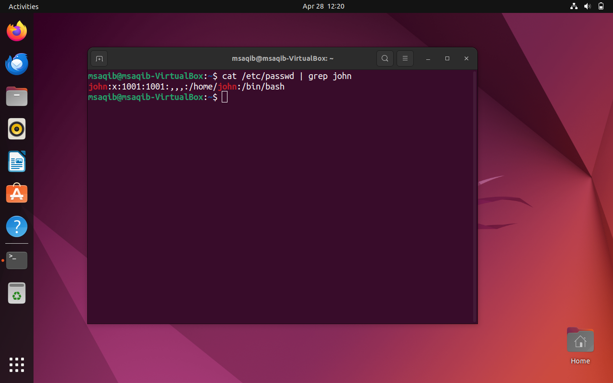
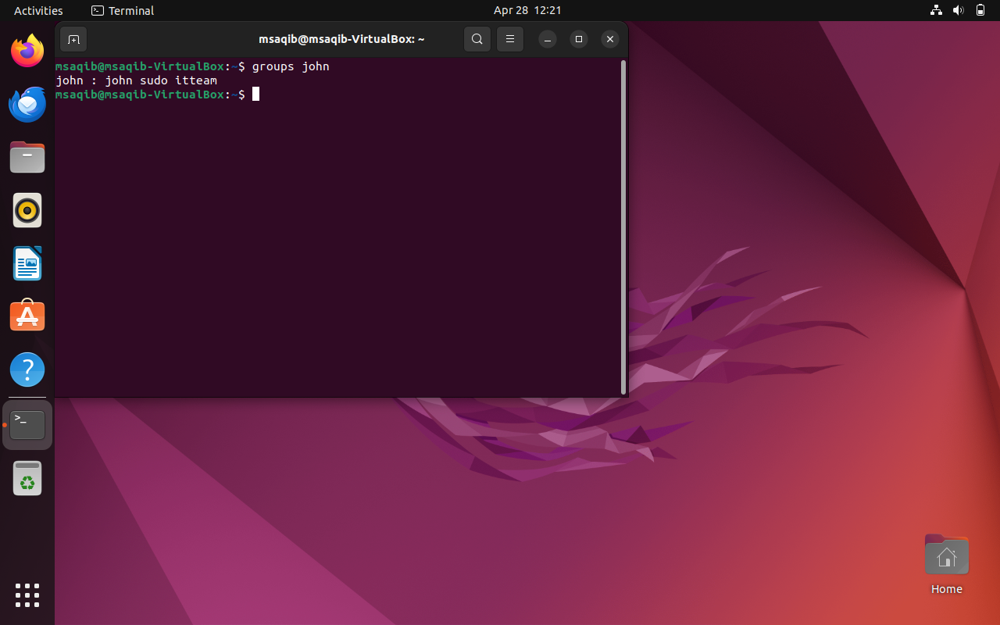
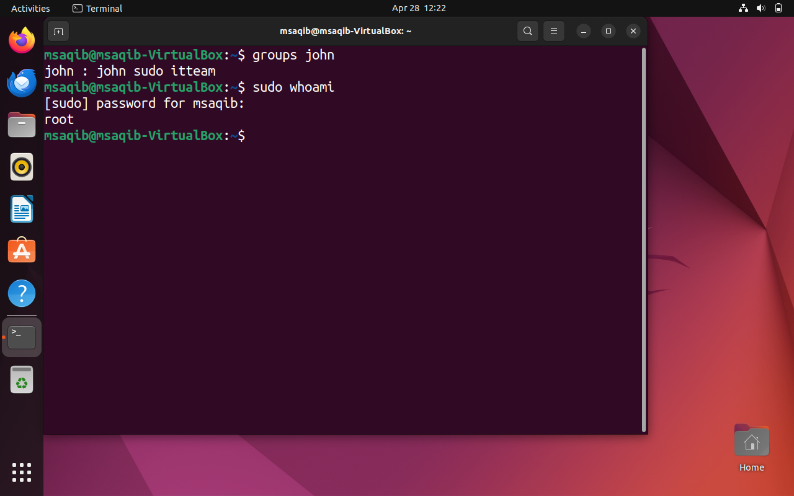
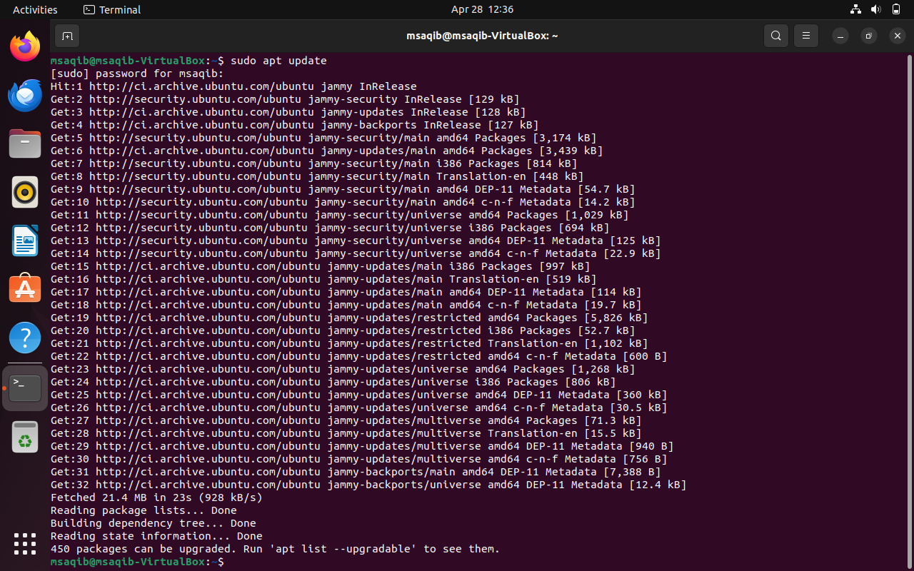
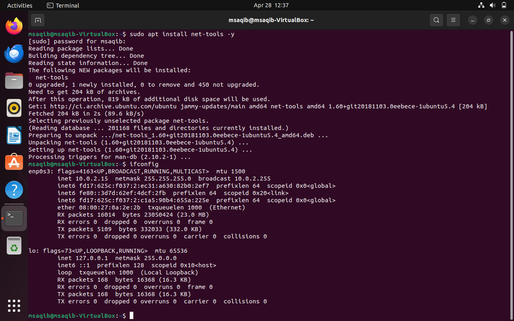
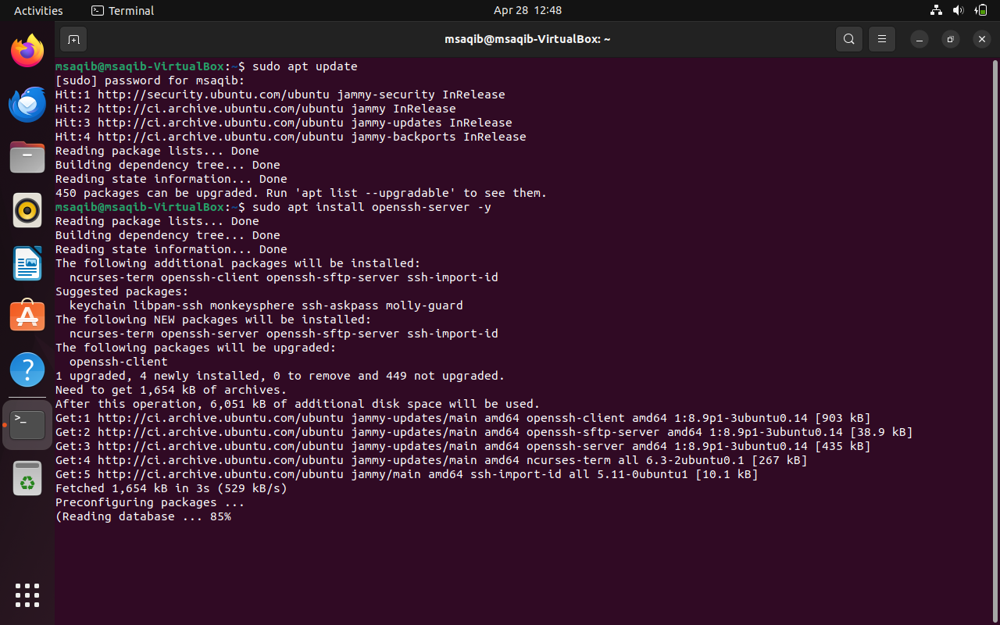
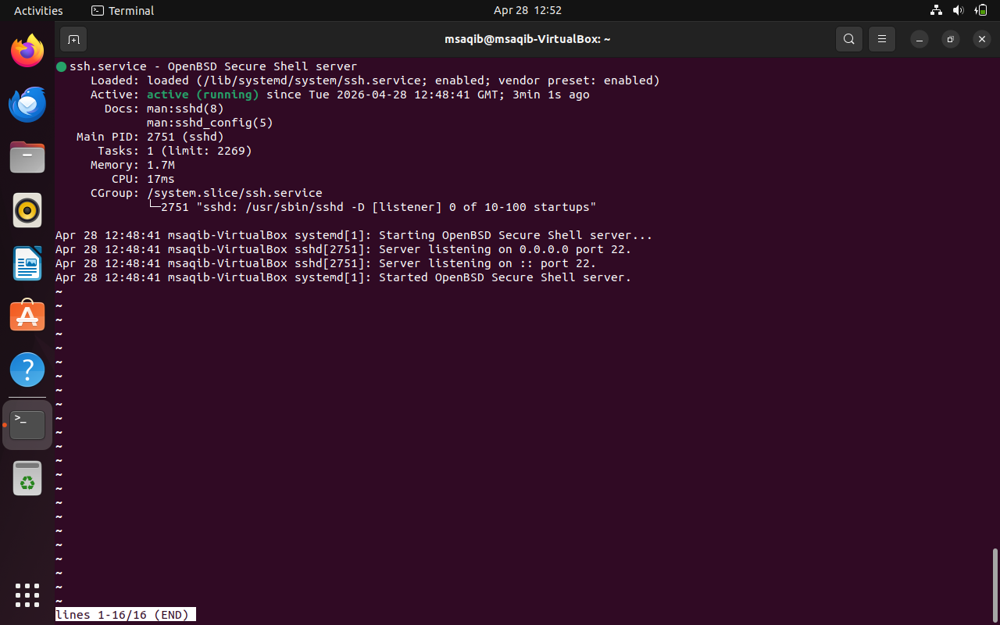
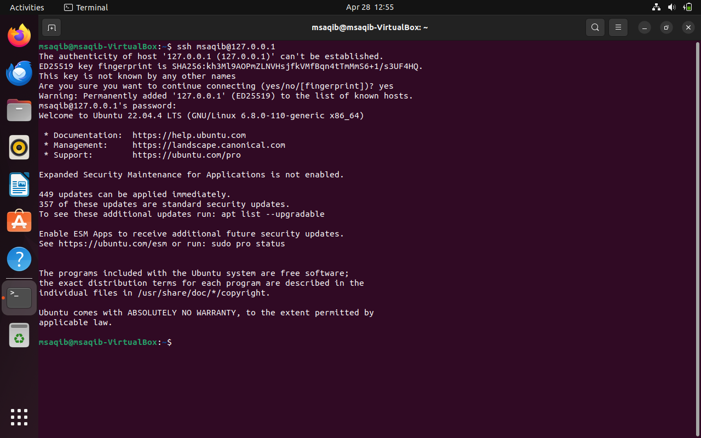
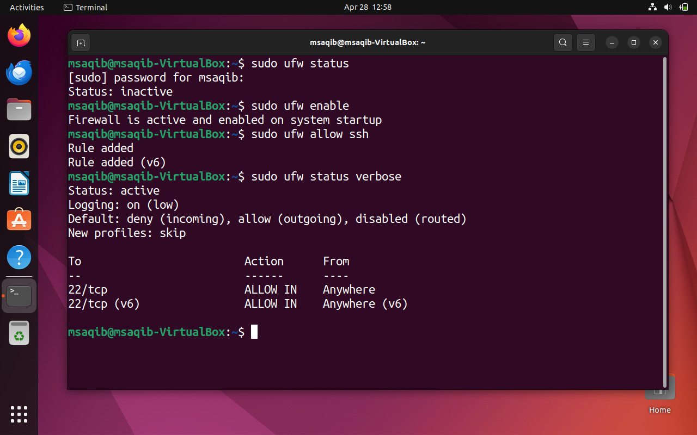
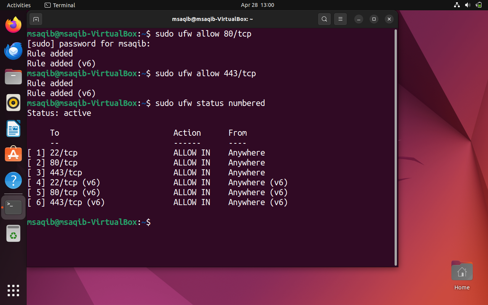

# 🐧 Ubuntu Linux — Command Line & Networking Lab

## 📋 Project Overview
Hands-on Ubuntu Linux lab built in VirtualBox covering 
essential command line skills, file management, 
permissions and network configuration.

## 🛠️ Tools & Technologies
| Tool | Details |
|------|---------|
| OS | Ubuntu Linux |
| Virtualization | Oracle VirtualBox |
| Interface | Terminal (CLI) |
| User | msaqib |

## ✅ What I Practiced
| Task | Status |
|------|--------|
| Basic Linux Commands | ✅ Done |
| File Creation & Management | ✅ Done |
| Text Editor (nano) | ✅ Done |
| File Permissions (chmod) | ✅ Done |
| Network Configuration (ip a) | ✅ Done |
| Ping & Connectivity Testing | ✅ Done |
| Routing Table (ip route) | ✅ Done |
| DNS Lookup (nslookup) | ✅ Done |
| User & Group Management | ✅ Done |
| sudo & Root Access | ✅ Done |
| Package Management (apt) | ✅ Done |
| SSH Server & Remote Access | ✅ Done |
| Firewall Management (ufw) | ✅ Done |

---

## 📸 Screenshots

### 🖥️ Basic Linux Commands

*1️⃣ Basic Commands — whoami, pwd, ls, mkdir*

> Practiced essential Linux commands:
> - whoami — identified current user as msaqib
> - pwd — showed current directory /home/msaqib
> - ls — listed Desktop, Documents, Downloads folders
> - mkdir — created IT-Lab-Portfolio/Linux directory
> - touch — created first-lab.txt file
> - echo — wrote text content into file
> - cat — displayed file contents to verify

---

*2️⃣ File Editing with Nano Text Editor*

> - nano — opened and edited first-lab.txt file
> - cat — verified file contents showing two lines:
>   "Completed basic Linux commands: whoami, pwd, ls"
>   "Learned file creation and documentation in Linux"
> Demonstrates ability to create and edit files
> using Linux terminal text editor

---

*3️⃣ File Permissions with chmod*

> - ls -l — showed original permissions -rw-rw-r--
>   meaning owner/group read-write, others read-only
> - chmod 600 — changed to private owner-only access
> - ls -l — verified new permissions -rw-------
>   meaning only owner can read and write the file
> Demonstrates understanding of Linux permission system

---

### 🌐 Network Configuration

*4️⃣ Network Interface & Ping Test*

> - ip a — displayed network interfaces showing
>   IP address 10.0.2.15 on enp0s3 adapter
> - ping -c 4 google.com — first test showed 75%
>   packet loss (network issue detected)
> - ping -c 4 google.com — second test showed 0%
>   packet loss confirming stable connectivity
> Demonstrates network troubleshooting skills

---

*5️⃣ Routing Table & DNS Lookup*

> - ip a — confirmed IP 10.0.2.15 on enp0s3
> - ip route — displayed routing table showing
>   default gateway 10.0.2.2 via enp0s3
> - nslookup google.com — successfully resolved
>   google.com to 142.250.202.174
> Demonstrates DNS resolution and routing knowledge

---

### 👤 User & Group Management

*6️⃣ User Created*

> Created new user john using adduser command
> Verified with cat /etc/passwd | grep john showing
> john's home directory and shell assigned successfully

---

*7️⃣ Group Membership*

> Created group itteam and added john to it
> groups john shows john : john sudo itteam
> proving successful group assignment

---

*8️⃣ sudo & Root Access*

> Added john to sudo group for admin privileges
> sudo whoami returns root confirming
> john has full administrative access

---

### 📦 Package Management

*9️⃣ Package Update (apt update)*

> Ran sudo apt update to refresh package lists
> fetching latest packages from Ubuntu repositories
> showing 450 packages available for upgrade

---

*🔟 net-tools Installation (ifconfig)*

> Installed net-tools package using sudo apt install
> Verified with ifconfig showing network interface
> enp0s3 with IP 10.0.2.15 and loopback interface

---

### 🔐 SSH Remote Access

*1️⃣1️⃣ SSH Server Installation*

> Installed openssh-server package using apt
> SSH client, server and sftp-server all installed
> ready for secure remote connections on port 22

---

*1️⃣2️⃣ SSH Service Running*

> systemctl status ssh shows Active: active (running)
> SSH server listening on port 22 for both
> IPv4 and IPv6 connections

---

*1️⃣3️⃣ SSH Port 22 Listening*

> Verified SSH connection using ssh msaqib@127.0.0.1
> Accepted host fingerprint and authenticated
> successfully with password

---

*1️⃣4️⃣ SSH Connection Success*

> Successfully connected via SSH showing
> Welcome to Ubuntu 22.04.4 LTS message
> proving SSH remote access fully working

---

### 🔥 Firewall (ufw)

*1️⃣5️⃣ Firewall Status & SSH Rule*

> Enabled ufw firewall with sudo ufw enable
> Added SSH rule with sudo ufw allow ssh
> Status shows port 22/tcp ALLOW IN from Anywhere

---

*1️⃣6️⃣ Firewall Rules — Ports 22, 80, 443*

> Added rules for HTTP port 80 and HTTPS port 443
> ufw status numbered shows all 6 active rules
> allowing SSH, HTTP and HTTPS traffic

---

## 🎯 Skills Demonstrated
- Linux User & Group Management
- sudo & Root Privilege Management
- Package Management with apt
- Network Interface Configuration
- SSH Server Installation & Configuration
- Remote Access via SSH
- Firewall Management with ufw
- Port Management & Security Rules
